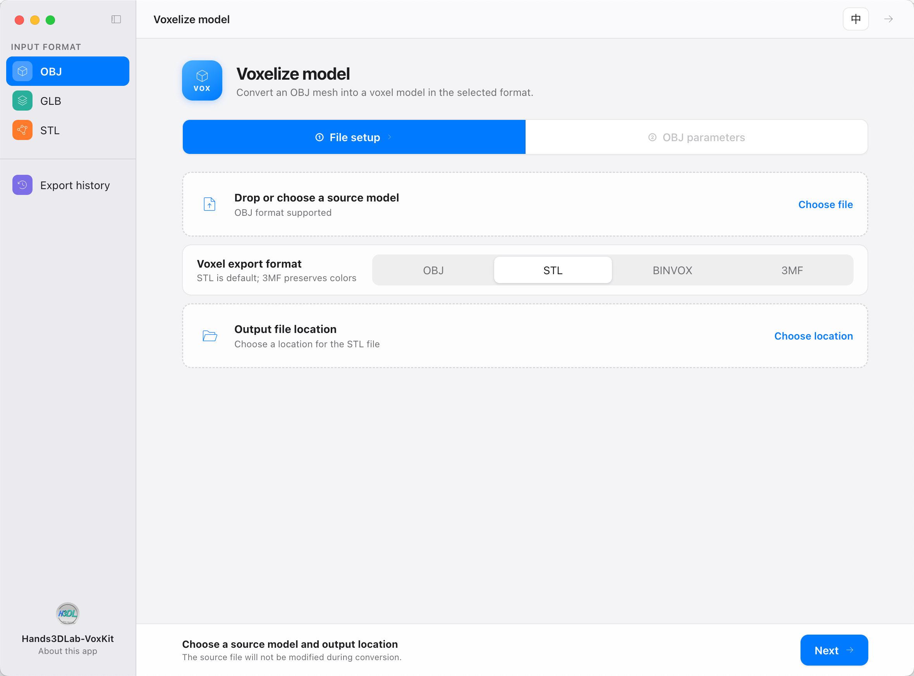
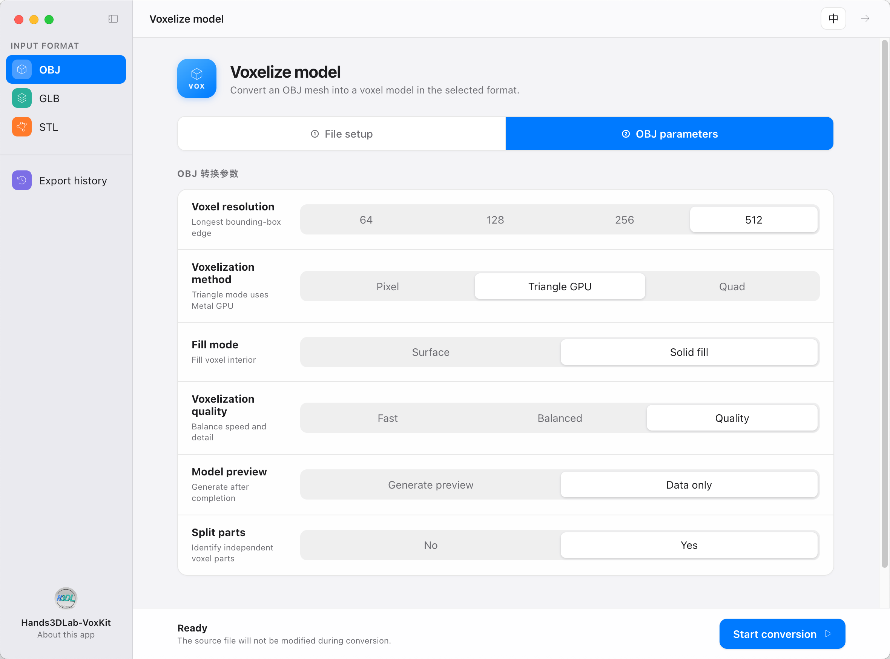
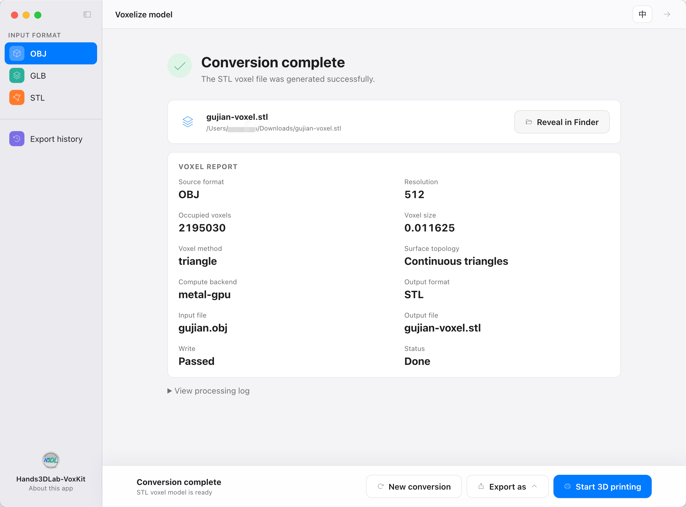
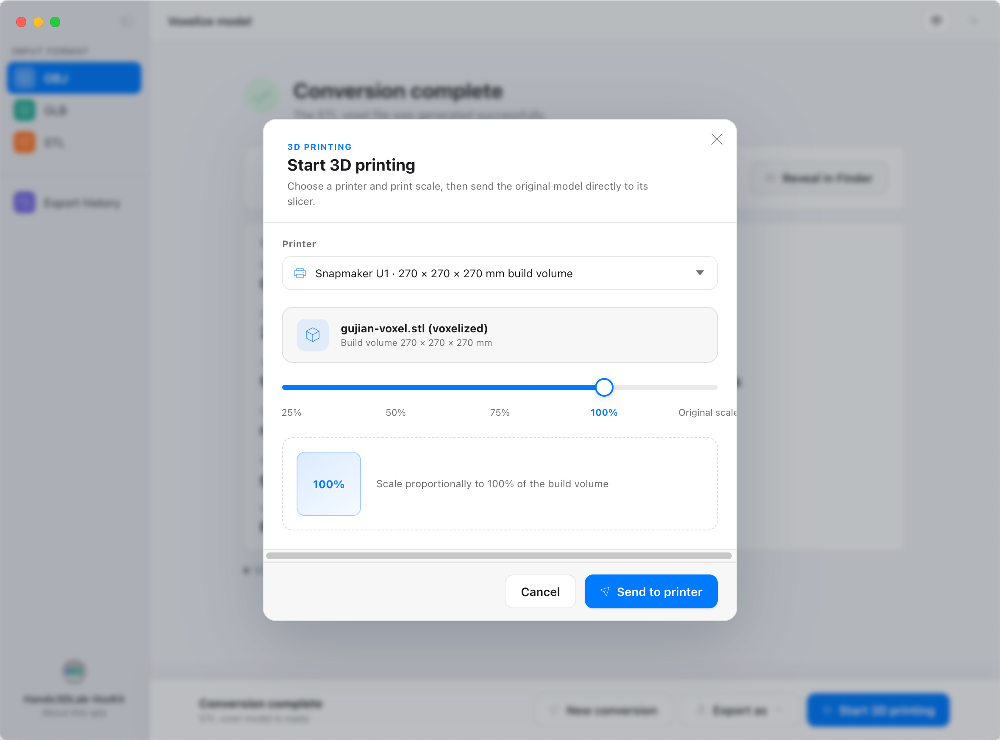

# Hands3DLab-VoxKit

[English](README.md) | [简体中文](README.zh-CN.md)

<table>
    <tr>
        <td width="50%"></td>
        <td width="50%"></td>
    </tr>
    <tr>
        <td width="50%"></td>
        <td width="50%"></td>
    </tr>
</table>

Hands3DLab-VoxKit is an offline Electron desktop client for converting OBJ, GLB, and STL meshes into voxel models. It supports configurable voxel resolution, Binvox, OBJ, STL, and 3MF export, print-scale settings, slicer integration, and export-history management. All conversion runs locally inside the desktop client.

Release downloads contain one self-contained Electron application. The voxelization engine is bundled inside the application resources and is not distributed as a separate `voxkit` download.

## Opening the unsigned Release on macOS

> **The macOS Release is not signed. After downloading it, macOS may report that the application cannot be opened. For a Release obtained from this repository and verified as trusted, remove its quarantine attribute manually before the first launch.**

Move the application into `/Applications`, open Terminal, and run:

```bash
xattr -dr com.apple.quarantine "/Applications/Hands3DLab-VoxKit.app"
```

Then open the application normally. If it is stored elsewhere, replace the path in the command with the actual `.app` path. The `-r` option applies the change to the complete application bundle.

Removing `com.apple.quarantine` bypasses a macOS download-protection check; it does not sign or notarize the application. Only run this command for a Release whose source and integrity you trust. Do not use it indiscriminately on applications from unknown sources.

## Features


## Download

Download the latest macOS release from [GitHub Releases](https://github.com/Hands3DLab/Hands3DLab-VoxKit/releases).


```text
.
├── CMakeLists.txt
├── LICENSE
├── README.md
├── README.zh-CN.md
└── electron/             # Desktop client
    ├── assets/            # Icons and screenshots
    ├── renderer/          # Desktop UI
    ├── src/               # Electron main process and preload bridge
    └── package.json
```

## Run the desktop client locally

```bash
npm --prefix electron install
npm --prefix electron start
```

Node.js and npm are required to run the client from source.

## License

Licensed under the [Apache License 2.0](LICENSE). See [NOTICE](NOTICE) for attribution information.
