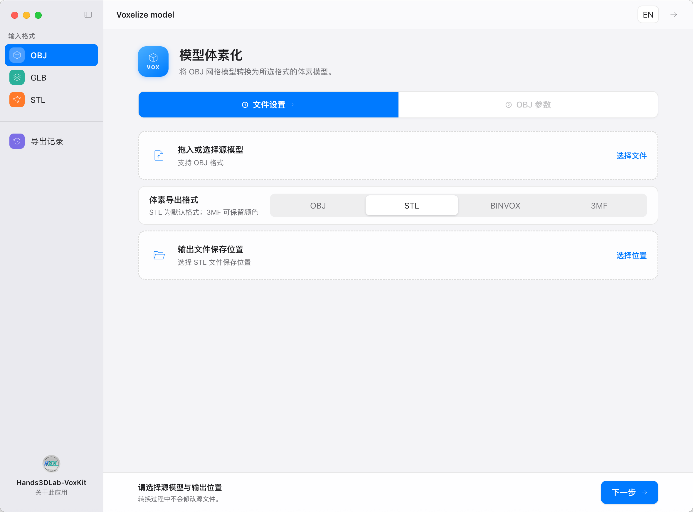
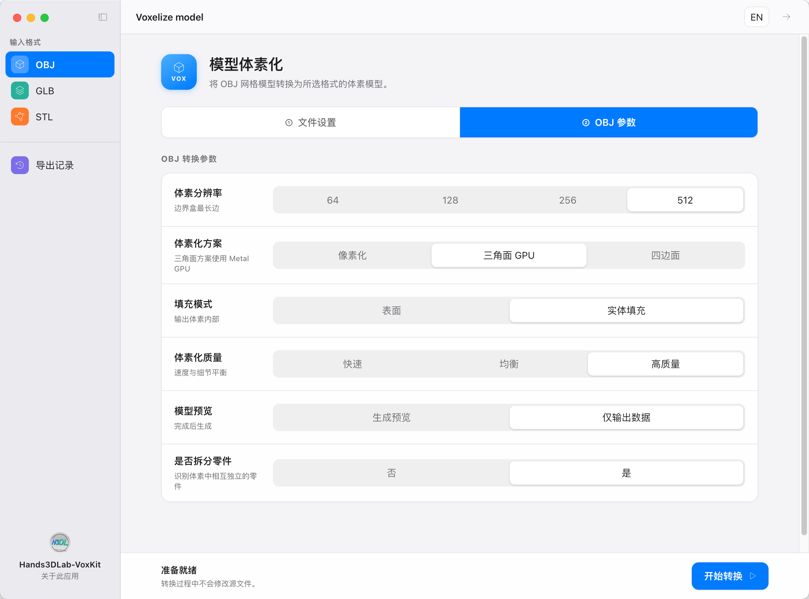
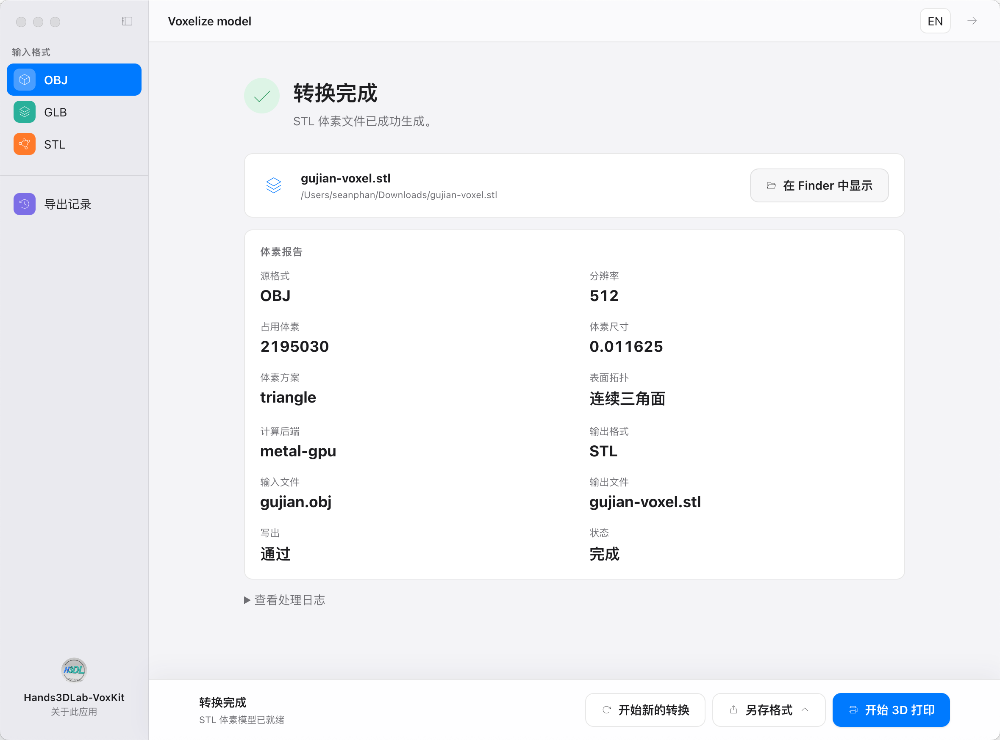
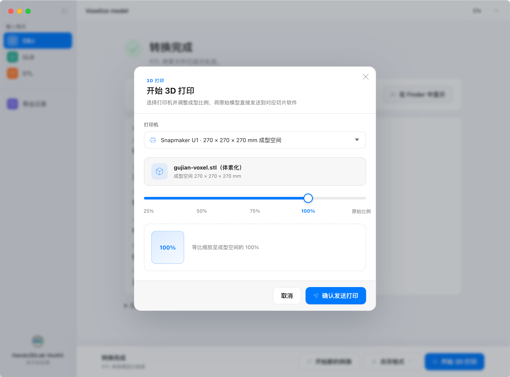

# Hands3DLab-VoxKit

[English](README.md) | [简体中文](README.zh-CN.md)

<table>
    <tr>
        <td width="50%"></td>
        <td width="50%"></td>
    </tr>
    <tr>
        <td width="50%"></td>
        <td width="50%"></td>
    </tr>
</table>

Hands3DLab-VoxKit 是一款离线 Electron 桌面客户端，用于将 OBJ、GLB 和 STL 网格模型转换为体素模型。软件支持自定义体素分辨率、Binvox/OBJ/STL/3MF 导出、打印比例设置、切片软件调用及导出记录管理。所有转换均在桌面客户端内部本地完成。
这在3D打印场景中尤其需要，当你的3D模型是由很多更高精的零件组成，例如建筑中的斗、柱、脊，在3D打印场景下，尤其是0.4mm的喷嘴，这些细小的零件无法表现时，你可能需要一键体素化3D模型，而不用再

## 功能（2026年9月5日）

- 离线、本地完成网格模型体素化
- macOS Metal/GPU 支持及 Windows CPU 支持
- 支持 Binvox、OBJ、STL 和 3MF 导出
- 支持针对不同3D打印机的打印缩放设置、切片软件调用与导出记录管理

## 后续计划

- SKP输入支持；
- 更多的切片软件导出支持

## 在 macOS 中运行

> **macOS Release 版本未签名。下载后，macOS 可能提示应用无法打开。确认 Release 来自本仓库且文件可信后，请在首次运行前手动移除隔离属性。**

将应用移动到 `/Applications`，打开“终端”并运行：

```bash
xattr -dr com.apple.quarantine "/Applications/Hands3DLab-VoxKit.app"
```

随后即可正常打开应用。如果应用位于其他位置，请将命令中的路径替换为实际 `.app` 路径。参数 `-r` 会对整个应用程序包递归执行操作。

移除 `com.apple.quarantine` 只是绕过 macOS 针对下载文件的隔离检查，并不会为应用签名或完成 Apple 公证。请仅对来源和完整性均可信的 Release 执行此命令，切勿对未知来源的应用随意使用。

## 在 Windows 中运行

1. 从 [GitHub Releases](https://github.com/Hands3DLab/Hands3DLab-VoxKit/releases) 下载 Windows x64 ZIP。
2. 将 ZIP **完整解压**到普通本地文件夹，不要直接在 ZIP 压缩包内部运行程序。
3. 在解压后的文件夹中启动 `Hands3DLab-VoxKit.exe`，不要把 EXE 单独移到其他位置。

### Windows使用中的问题

- **提示“Voxelization engine not found”**：重新完整解压，并确认 `Hands3DLab-VoxKit.exe` 旁边存在 `resources` 文件夹，且其中包含 `resources/voxkit.exe`。不要另行下载内核；此提示通常表示解压不完整、文件被安全软件隔离，或应用文件被移动。
- **Windows Defender 或 SmartScreen 警告**：当前 Release 尚未签名。请确认软件来自可信的 GitHub 仓库，并在有条件时核对发布的校验和。确认来源可信后，才可使用 Windows 的“更多信息 → 仍要运行”。不要全局关闭 Defender 或 SmartScreen。
- **提示缺少 DLL 或 UCRT/运行时组件**：如果 Windows 报告缺少系统运行时，请从 Microsoft 安装最新的 x64 Microsoft Visual C++ Redistributable，然后重新启动客户端。不同 Windows 版本的兼容性可能不同；这不意味着需要单独下载 `voxkit` 可执行文件。
- **切片软件或打印功能无法启动**：如有需要，请安装 Snapmaker Orca/OrcaSlicer，并将其保留在标准安装目录。如果客户端无法找到切片软件，仍可先导出模型，再在切片软件中手动打开导出文件。
- **转换模式限制**：Windows 版本为 CPU-only，仅支持 Pixel 和 Quad 模式。Triangle 模式依赖 macOS Metal/GPU 路径，Windows 下不可用。

Windows 安装包的目录结构及 PE/ZIP 完整性会在打包阶段检查。实际启动、SmartScreen 行为和切片软件联动仍取决于具体 Windows 环境，应在目标设备上进行验证。

## 下载与构建

请从 [GitHub Releases](https://github.com/Hands3DLab/Hands3DLab-VoxKit/releases) 下载最新的 macOS 或 Windows 完整 Electron 客户端。项目不提供单独的原生内核下载：

### 构建环境要求

从源码构建需要：

- macOS 或 Windows，以及支持 C++17 的编译器
- [CMake](https://cmake.org/) 3.20 或更高版本
- [Node.js](https://nodejs.org/) 与 npm
- Python 3，用于运行 CTest 集成测试
- Boost 头文件，其中包括用于解析 GLB 文件的 `boost/json/src.hpp`
- 在 macOS 中，启用 GPU 支持后，构建系统会在可用时自动使用 Metal 和 Foundation framework

### 构建原生体素化内核

在项目根目录执行以下命令，配置并构建 Release 版本：

```bash
cmake -S . -B build -DCMAKE_BUILD_TYPE=Release -DENABLE_GPU=ON
cmake --build build --parallel 2
```

构建完成后，原生 `voxkit` 可执行文件会生成在 `build/` 目录中。在 macOS 上，当所需 Apple framework 可用时，`ENABLE_GPU=ON` 会启用 Metal 后端。如需构建仅使用 CPU 的版本，请改用 `-DENABLE_GPU=OFF`。

CMake 默认启用测试集成。使用以下命令运行测试：

```bash
ctest --test-dir build --output-on-failure
```

如需在配置时关闭测试集成，请添加 `-DBUILD_TESTS=OFF`。

在项目根目录也可以使用以下便捷命令完成原生内核构建：

```bash
npm run build
```

### 构建并运行 Electron 客户端

安装 Electron 依赖并启动桌面客户端：

```bash
npm --prefix electron install
npm --prefix electron start
```

也可以从 `electron` 目录对应的 npm 脚本构建原生内核：

```bash
npm --prefix electron run build
```

打包完整 Electron 客户端时，原生内核会作为应用内部资源一同打包。请勿将 `voxkit` 作为独立下载文件分发或移动。

```text
.
├── CMakeLists.txt
├── LICENSE
├── README.md
├── README.zh-CN.md
└── electron/             # 桌面客户端
    ├── assets/            # 图标和截图
    ├── renderer/          # 桌面界面
    ├── src/               # Electron 主进程与 preload 桥接
    └── package.json
```
## 在本地运行桌面客户端

```bash
npm --prefix electron install
npm --prefix electron start
```

从源码运行客户端需要 Node.js 与 npm。

## 许可

本项目依据 [Apache License 2.0](LICENSE) 授权。署名信息请参阅 [NOTICE](NOTICE)。
